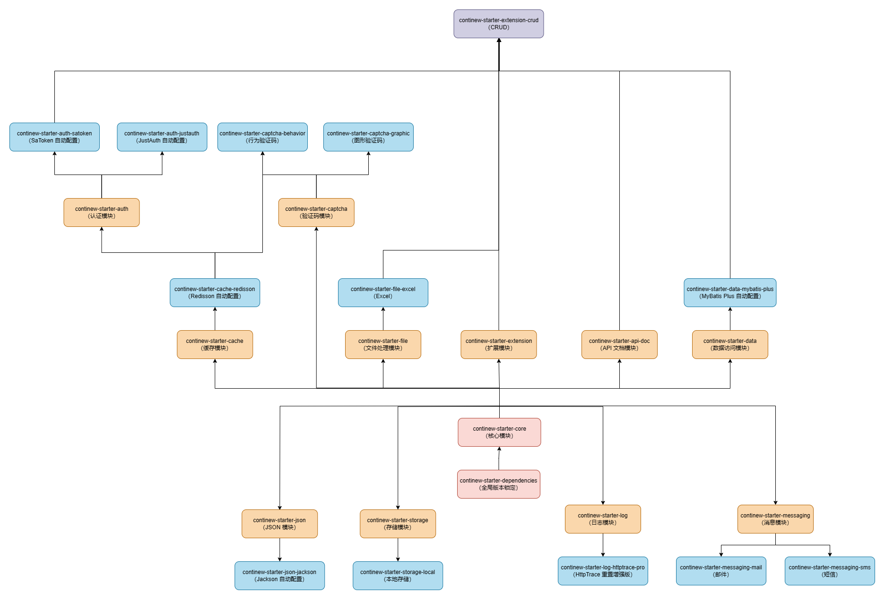

# ContiNew Starter

<a href="https://github.com/Charles7c/continew-starter/blob/dev/LICENSE" target="_blank">

</a>
<a href="https://github.com/Charles7c/continew-starter" target="_blank">

</a>
<a href="https://github.com/Charles7c/continew-starter" target="_blank">

</a>
<a href="https://github.com/Charles7c/continew-starter" target="_blank">

</a>
<a href="https://gitee.com/Charles7c/continew-starter" target="_blank">

</a>
<a href="https://gitee.com/Charles7c/continew-starter" target="_blank">

</a>
<a href="https://github.com/Charles7c/continew-starter" target="_blank">

</a>
<a href="https://github.com/Charles7c/continew-starter" target="_blank">

</a>

## 简介

ContiNew Starter（Continue New Starter）基于“约定优于配置”的理念，再次精简常规配置，提供一个更为完整的配置解决方案，帮助开发人员更加快速的集成常用第三方库或工具到 Spring Boot Web 应用程序中。

ContiNew Starter 包含了一系列经过企业实践优化的依赖包（如 MyBatis-Plus、SaToken），可轻松集成到应用中，为开发人员减少手动引入依赖及配置的麻烦，为 Spring Boot Web 项目的灵活快速构建提供支持。

> ContiNew Starter 源自 [ContiNew Admin](https://github.com/Charles7c/continew-admin) 中后台管理框架/脚手架项目。在 ContiNew Admin 发展到一定程度时，作者发现新手用户上手时需要关注过多的脚手架通用基础能力，而且如果想要在一个全新项目中使用这些基础能力，“迁移”起来也很麻烦。于是，ContiNew Starter 应运而生，作者在 ContiNew Admin 2.x 版本时，将项目中的通用基础能力进行了抽离和深度优化。这样，无论是在 ContiNew Admin 中使用，还是单独使用这些基础能力，都可以更加轻松。

## 解决痛点

在开发一个 Java Web 项目之前，我们可能需要做如下准备工作：

1. 引入 Spring Boot 父项目进行版本锁定（无 Spring 不 Java）
2. 引入 Spring Boot Web 依赖
3. 根据自身需要引入不同组件的 Starter
4. 根据自身需要对引入的 Starter 进行配置（查阅文档或通过搜索引擎查找常用配置）
   1. 编写 Java 配置
   2. 编写 application.yml 配置
5. 编写各种全局处理器
6. 开始使用

在 Spring Boot “约定优于配置” 理念的帮助下，我们开发一个 Spring Java Web 程序已经简化到了不可思议的程度，而且很多设计良好的组件 Starter 提供了极大的扩展性，提供了非常多的配置，给使用者最大的可行性，当你需要处理一些自定义场景时，这些配置简直是太过方便。

然而，极大的扩展性带来的另一面就是配置“混乱”，对于小白用户，初步使用某个组件时，仅配置就足够“吃一壶”。因此，各种脚手架项目应运而生，你可能会想，这基础配置关脚手架项目什么事？**脚手架项目的作用不仅仅是提供一系列通用基础功能，更多的是提供了一种通用的解决方案，无论是针对所使用组件的配置，还是实现的某个功能的设计，亦或是开发规范** 。即使是一个小白，把脚手架项目拿过来，只需要删减下不需要的功能，改动下品牌元素，就可以继续在其基础上进行开发一个成熟的项目。

ContiNew Starter 就是将脚手架项目中的通用基础配置进行了封装及深度优化，从企业通用实践层面精简配置，让一个完全从头开始或已有的项目，在使用部分组件时变得更轻松。

## 项目源码

| 开源平台      | 源码地址                                      |
| :------------ | :-------------------------------------------- |
| GitHub        | https://github.com/Charles7c/continew-starter |
| Gitee（码云） | https://gitee.com/Charles7c/continew-starter  |

## 像数1，2，3一样容易

1.在项目 pom.xml 中锁定版本（**下方两种方式请任选其一**）

第一种方式：如您使用的是 Spring Boot Parent 的方式，则替换 Spring Boot Parent 为 ContiNew Starter

```xml
<parent>
    <groupId>top.charles7c.continew</groupId>
    <artifactId>continew-starter</artifactId>
    <version>{latest-version}</version>
</parent>
```

第二种方式：如您使用的是引入 Spring Boot Dependencies 的方式，则替换 Spring Boot Dependencies 为 ContiNew Starter Dependencies

```xml
<properties>
    <java.version>17</java.version>
    <maven.compiler.source>${java.version}</maven.compiler.source>
    <maven.compiler.target>${java.version}</maven.compiler.target>
    <project.build.sourceEncoding>UTF-8</project.build.sourceEncoding>
</properties>

<dependencyManagement>
    <dependencies>
        <!-- ContiNew Starter Dependencies -->
        <dependency>
            <groupId>top.charles7c.continew</groupId>
            <artifactId>continew-starter-dependencies</artifactId>
            <version>{latest-version}</version>
            <type>pom</type>
            <scope>import</scope>
        </dependency>
    </dependencies>
</dependencyManagement>
```

2.在项目 pom.xml 中引入所需模块依赖

```xml
<dependencies>
    <!-- 核心模块 -->
    <dependency>
        <groupId>top.charles7c.continew</groupId>
        <artifactId>continew-starter-core</artifactId>
    </dependency>
</dependencies>
```

3.在  application.yml  中根据引入模块，添加所需配置

e.g. 跨域配置

```yaml
--- ### 跨域配置
continew-starter:
  cors:
    enabled: true
    # 配置允许跨域的域名
    allowed-origins: '*'
    # 配置允许跨域的请求方式
    allowed-methods: '*'
    # 配置允许跨域的请求头
    allowed-headers: '*'
    # 配置允许跨域的响应头
    exposed-headers: '*'
```

<details>
  <summary>抢先体验快照（SNAPSHOT）版本💡</summary>

> **注意：** 快照版本目前处于开发测试阶段，其中很多特性或改动尚不稳定，可能会因为修复或优化而频繁调整。因此，仅可用于体验，切勿用于生产环境！

1.在项目 pom.xml 中配置 SNAPSHOT（快照）仓库地址（如果你已配有其他仓库地址，追加下方快照仓库地址即可）

```xml
<repositories>
    <repository>
        <id>sonatype-nexus-snapshots</id>
        <name>Sonatype Nexus Snapshots</name>
        <url>https://s01.oss.sonatype.org/content/repositories/snapshots/</url>
        <snapshots>
            <updatePolicy>always</updatePolicy>
            <enabled>true</enabled>
        </snapshots>
    </repository>
</repositories>
```

2.将 ContiNew Starter 版本改为对应快照版本，例如：1.1.0-SNAPSHOT

</details>

## 模块结构

| 模块名称                           | 模块说明                                            | 依赖版本                                                     |
| ---------------------------------- | --------------------------------------------------- | ------------------------------------------------------------ |
| continew-starter-core              | 核心模块：包含跨域、线程池等自动配置                | <a href="https://spring.io/projects/spring-boot" target="_blank">Spring Boot</a>：3.1.7<br /><a href="https://undertow.io/" target="_blank">Undertow</a>：2.3.10.Final<br /><a href="https://www.hutool.cn/" target="_blank">Hutool</a>：5.8.24<br />mica-ip2region：3.1.6 |
| continew-starter-json-jackson      | JSON 模块：Jackson 自动配置                         | Jackson：2.15.3                                              |
| continew-starter-api-doc           | API 文档模块：Knife4j 自动配置                      | <a href="https://doc.xiaominfo.com/" target="_blank">Knife4j</a>：4.4.0 |
| continew-starter-log-httptrace-pro | 日志模块：Spring Boot Actuator HttpTrace 重置增强版 |                                                              |
| continew-starter-storage-local     | 存储模块：本地存储                                  |                                                              |
| continew-starter-file-excel        | 文件处理模块：Excel 相关配置                        | <a href="https://easyexcel.opensource.alibaba.com/" target="_blank">Easy Excel</a>：3.3.4 |
| continew-starter-captcha-graphic   | 验证码模块：图形验证码                              | Easy Captcha：1.6.2                                          |
| continew-starter-captcha-behavior  | 验证码模块：行为验证码                              | AJ-Captcha：1.3.0                                            |
| continew-starter-cache-redisson    | 缓存模块：Redisson 自动配置                         | <a href="https://github.com/redisson/redisson/wiki/Redisson%E9%A1%B9%E7%9B%AE%E4%BB%8B%E7%BB%8D" target="_blank">Redisson</a>：3.25.2 |
| continew-starter-data-mybatis-plus | 数据访问模块：MyBatis Plus 自动配置                 | <a href="https://baomidou.com/" target="_blank">MyBatis Plus</a>：3.5.5<br /><a href="https://www.kancloud.cn/tracy5546/dynamic-datasource/2264611" target="_blank">dynamic-datasource-spring-boot-starter</a>：4.2.0<br /><a href="https://github.com/p6spy/p6spy" target="_blank">P6Spy</a>：3.9.1 |
| continew-starter-auth-satoken      | 认证模块：SaToken 自动配置                          | <a href="https://sa-token.dev33.cn/" target="_blank">Sa-Token</a>：1.37.0 |
| continew-starter-auth-justauth     | 认证模块：JustAuth 自动配置                         | <a href="https://justauth.cn/" target="_blank">Just Auth</a>：1.16.6 |
| continew-starter-messaging-mail    | 消息模块：邮件                                      | Jakarta Mail：1.1.0                                          |
| continew-starter-messaging-sms     | 消息模块：短信                                      | <a href="https://sms4j.com/" target="_blank">SMS4J</a>：3.0.4 |
| continew-starter-extension-crud    | 扩展模块：CRUD 通用内容封装                         |                                                              |



## 贡献代码

### 分支说明

ContiNew Starter 的分支目前分为下个大版本的开发分支和上个大版本的维护分支，PR 前请注意对应分支是否处于维护状态。

| 分支  | 说明                                                         |
| ----- | ------------------------------------------------------------ |
| dev   | 开发分支，默认为下个大版本的 SNAPSHOT 版本，接受新功能或新功能优化 PR |
| x.x.x | 维护分支，在 vx.x.x 版本维护期终止前（一般为下个大版本发布前），用于修复上个版本的 Bug，只接受已有功能修复，不接受新功能 PR |

### 流程步骤

如果您想提交新功能或优化现有代码，可以按照以下步骤操作：

1. 首先，在 Gitee 或 Github 上将项目 fork 到您自己的仓库
2. 然后，将 fork 过来的项目（即您的项目）克隆到本地
3. 切换到当前仍在维护的分支（请务必充分了解分支使用说明，可进群联系维护者确认）
4. 开始修改代码，修改完成后，将代码 commit 并 push 到您的远程仓库
5. 在 Gitee 或 Github 上新建 pull request（pr），选择好源和目标，按模板要求填写说明信息后提交即可（多多参考 [已批准合并的 pr 记录](https://github.com/Charles7c/continew-starter/pulls?q=is%3Apr+is%3Amerged)，会大大增加批准合并率）
6. 最后，耐心等待维护者合并您的请求即可

请记住，如果您有任何疑问或需要帮助，我们将随时提供支持。

> [!IMPORTANT]
> 欢迎大家为 ContiNew Starter 贡献代码，我们非常感谢您的支持！为了更好地管理项目，维护者有一些要求：
>
> 1. 请确保代码、配置文件的结构和命名规范良好，完善的代码注释，并遵循阿里巴巴的 <a href="https://github.com/Charles7c/continew-starter/blob/dev/.style/Java%E5%BC%80%E5%8F%91%E6%89%8B%E5%86%8C(%E9%BB%84%E5%B1%B1%E7%89%88).pdf" target="_blank">《Java开发手册(黄山版)》</a> 中的代码规范，保证代码质量和可维护性
> 2. 在提交代码前，请按照 [Angular 提交规范](https://github.com/conventional-changelog/conventional-changelog/tree/master/packages/conventional-changelog-angular) 编写 commit 的 message（建议在 IntelliJ IDEA 中下载并安装 Git Commit Template 插件，以便按照规范进行 commit）
> 3. 提交代码之前，请关闭所有代码窗口，执行 `mvn compile` 命令（代码格式化插件会在项目编译时对全局代码进行格式修正），编译通过后，不要再打开查看任何代码窗口，直接提交即可

## 反馈交流

💬 欢迎各位小伙伴儿扫描下方二维码加好友，备注 `cnadmin`，拉你进群，探讨技术、提提需求~   

加入交流群后，你将会：

- 第一时间收到框架动态
- 第一时间收到框架更新通知
- 第一时间收到框架 Bug 通知
- 和众多大佬互相 (huá shuǐ) 交流 (mō yú)

<div align="left">
  
</div>
<details>
<summary>无加群意愿</summary>
💬 如无加群意愿，欢迎在 <a href="https://github.com/Charles7c/continew-starter/issues" target="_blank">Issues</a> 中反馈交流~ 🍻
</details>

## 鸣谢

### 鸣谢

感谢参与贡献的每一位小伙伴🥰

<a href="https://github.com/Charles7c/continew-starter/graphs/contributors">
	
</a>

### 特别鸣谢

- 感谢 <a href="https://www.jetbrains.com/" target="_blank">JetBrains</a> 提供的 <a href="https://www.jetbrains.com/shop/eform/opensource" target="_blank">非商业开源软件开发授权</a> 
- 感谢 <a href="https://github.com/baomidou/mybatis-plus" target="_blank">MyBatis Plus</a>、<a href="https://github.com/dromara/sa-token" target="_blank">Sa-Token</a> 、<a href="https://github.com/xiaoymin/knife4j" target="_blank">Knife4j</a>、<a href="https://github.com/dromara/hutool" target="_blank">Hutool</a> 等国产开源组件作者为国内开源世界作出的贡献
- 感谢 <a href="https://github.com/elunez/eladmin" target="_blank">ELADMIN</a>、<a href="https://github.com/dromara/RuoYi-Vue-Plus" target="_blank">RuoYi-Vue-Plus</a>、<a href="https://gitee.com/herodotus/dante-engine" target="_blank">Dante-Engine</a>，致敬各位作者为开源脚手架领域作出的贡献
  - e.g. 扩展于 ELADMIN 项目开源的 QueryHelper 组件
  - e.g. 扩展于 RuoYi-Vue-Plus 项目封装的 SaToken 相关认证鉴权配置
  - e.g. 扩展于 Dante-Engine 项目封装的 Redisson 相关配置
- 感谢项目使用或未使用到的每一款开源组件，致敬各位开源先驱 :fire:

## License

- 遵循 <a href="https://github.com/Charles7c/continew-starter/blob/dev/LICENSE" target="_blank">LGPL-3.0</a> 开源许可协议
- Copyright © 2022-present <a href="https://blog.charles7c.top" target="_blank">Charles7c</a>

## GitHub Star 趋势

